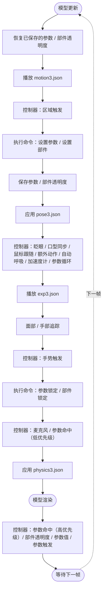
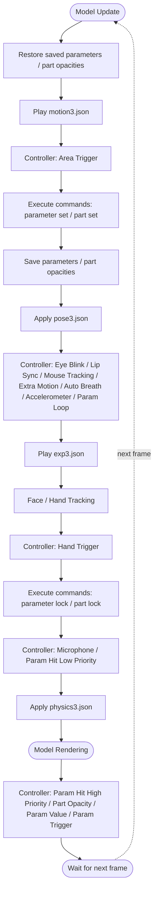

`README.md`

# azur-lane-live2d-display

## 学习目标

参考 Live2D 官方编辑器执行流程：

https://live2d.pavostudio.com/doc/zh-cn/exstudio/live2d-editor/#_1

原图：

https://live2d.pavostudio.com/doc/zh-cn/exstudio/images/le-3-01.png

## Live2D 执行流程（中文）

## Live2D Execution Flow (English)

