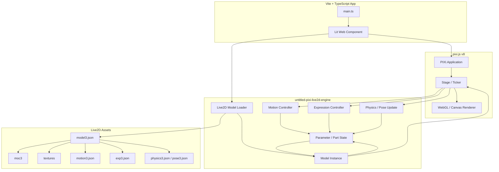

学习目标: https://live2d.pavostudio.com/doc/zh-cn/exstudio/live2d-editor/#_1

```mermaid
flowchart TD
  A([Model Update]) --> B[Restore saved parameters / part opacities]
  B --> C[Play motion3.json]
  C --> D[Controller: Area Trigger]
  D --> E[Execute commands: parameter set / part set]
  E --> F[Save parameters / part opacities]
  F --> G[Apply pose3.json]
  G --> H[Controller: Eye Blink / Lip Sync / Mouse Tracking / Extra Motion / Auto Breath / Accelerometer / Param Loop]
  H --> I[Play exp3.json]
  I --> J[Face / Hand Tracking]
  J --> K[Controller: Hand Trigger]
  K --> L[Execute commands: parameter lock / part lock]
  L --> M[Controller: Microphone / Param Hit Low Priority]
  M --> N[Apply physics3.json]
  N --> O([Model Rendering])
  O --> P[Controller: Param Hit High Priority / Part Opacity / Param Value / Param Trigger]
  P --> Q([Wait for next frame])
  Q -. next frame .-> A
```

我的项目:

```mermaid
flowchart TD
  subgraph App["Vite + TypeScript App"]
    A[main.ts]
    B[Lit Web Component]
  end

  subgraph Render["pixi.js v8"]
    C[PIXI.Application]
    D[Stage / Ticker]
    E[WebGL / Canvas Renderer]
  end

  subgraph Engine["untitled-pixi-live2d-engine"]
    F[Live2D Model Loader]
    G[Model Instance]
    H[Motion Controller]
    I[Expression Controller]
    J[Physics / Pose Update]
    K[Parameter / Part State]
  end

  subgraph Assets["Live2D Assets"]
    L[model3.json]
    M[moc3]
    N[textures]
    O[motion3.json]
    P[exp3.json]
    Q[physics3.json / pose3.json]
  end

  A --> B
  B --> C
  C --> D
  D --> E

  B --> F
  F --> L
  L --> M
  L --> N
  L --> O
  L --> P
  L --> Q

  F --> G
  G --> K
  D --> H
  D --> I
  D --> J

  H --> K
  I --> K
  J --> K
  K --> G
  G --> D
```
